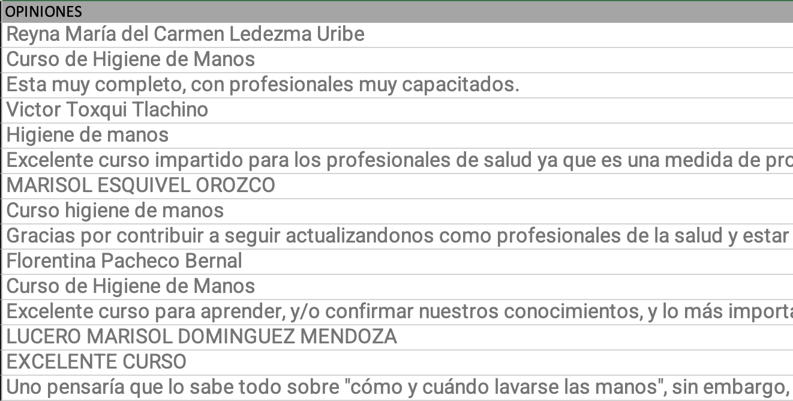

# Reporting Sentiment Analysis (Course's Opinions) 💻

README language available : 

* English
* Español


**English**
-------------------------


**Español**
-------------------------
### Objetivo:

La finalidad de este proyecto es hacer un archivo ejecutable que entregue un reporte (análisis) sobre las opiniones de un curso en una plataforma.


### Objetivo Específico:

* Script que permita descargar las librerías (python) necesarias para el análisis
* Script que genere un archivo pdf con el reporte análisis (genérico) de las opiniones

### Retos:

* Las opiniones y comentarios del curso no se pueden descargar en un archivo excel ni en algún otro documento de texto. Estos tienen que ser copiados y pegados, trayendo consigo información relevante pero no estructurada. Esto causa que se tenga una tabla con una columna. En el primer renglón aparece el nombre de la persona que escribió el comentario, en el segundo el nombre del comentario y en el tercero el comentario en sí. Este patrón se repite para cada uno de los diferentes comentarios orientados a dicho curso.

### Requisitos:

* Excel : Crear un archivo con extensión **.xlsx**. Posteriormente en una hoja dentro de dicho excel llamada **Opiniones** pegar todos los comentarios obtenidos de la plataforma con la estructura antes mencionada (*1. Nombre persona. 2. Nombre comentario. 3. Comentario*). Ejemplo:

	

* Python 3

* Librerías descargadas y atualizadas. Basta con correr el shell script con `./initial-libraries.sh`. Este archivo puede ser encontrado en la carpeta **Scripts**.

### Exec

Para ejecutar el programa basta con correr el archivo `AnalisisSentimientos.py` que se encuentra en la carpeta **Data**. Este archivo debe de estar en el mismo directorio donde se encuentra nuestro excel que contiene las opiniones (con el formato antes mencionado). El comando genérico es el siguiente:

```
py3 AnalisisSentimientos.py <Nombre_Archivo.xlsx>  "<Nombre_del_curso>"
```

Esta ejecución tardará aproximadamente 5 minutos (con 900 comentarios) debido a que internamente traduce cada opinión. Si bien esto no es lo ideal en el análisis de sentimientos (en español) se hace de esta forma pues no se cuentan con los datos suficientes para entrenar un modelo de clasificación de sentimientos. No obstante la polaridad asignada está muy bien implementada en NLTK para el idioma inglés.

### Resultados

En la misma carpeta en la que se alojan el script y los datos (**Data**) se guardará el archivo en formato PDF que contendrá el reporte del análisis. El nombre que hayas introducido en el segundo argumento al momento de ejecutar el script `"<Nombre_del_curso>"` será el nombre el cuál se utilizará para las gráficas y títulos donde sea necesario poner el título del curso.
